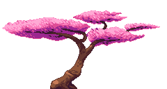

	

# Sakura
Sakura is a C++ library for modifying maps from the game Celeste. Currently it is just experimental, however it will likely be used in further projects. Feel free to use it in any of your projects.

Documentation can be found here: [Sakura Documentation](https://aracitdev.github.io/Sakura/)

---

# Dependencies
It relies only on the tinyxml2 library and should be able to work with most operating systems (including windows, mac, and Linux).

TinyXML2 is here: [TinyXml2](http://www.grinninglizard.com/tinyxml2/)

---
# Building
Sakura also includes a makefile made for a Linux like environment on windows (msys2 or cygwin). Assuming you have this environment, its as simple as running the make command while in the Sakura directory. I've tried to make this makefile compatible for Linux, however I don't have a Linux dev environment available to me to make sure of this.